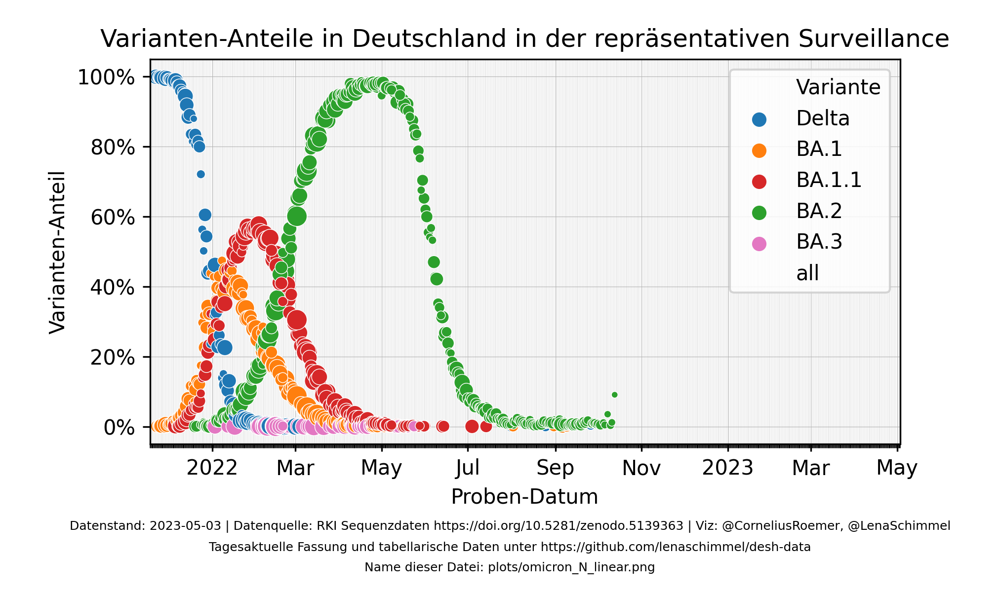
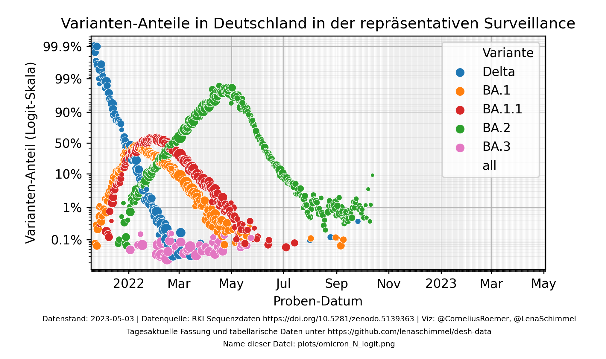
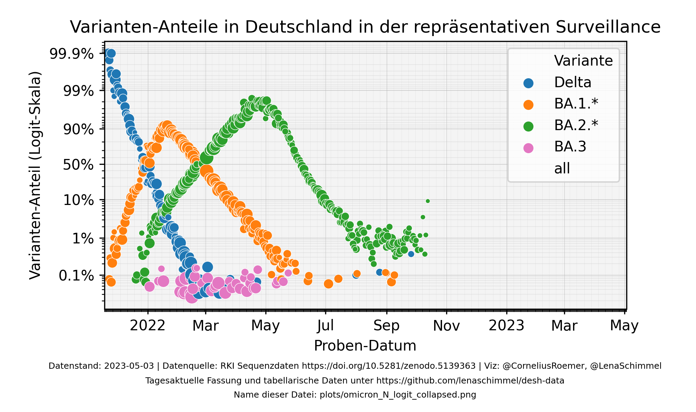
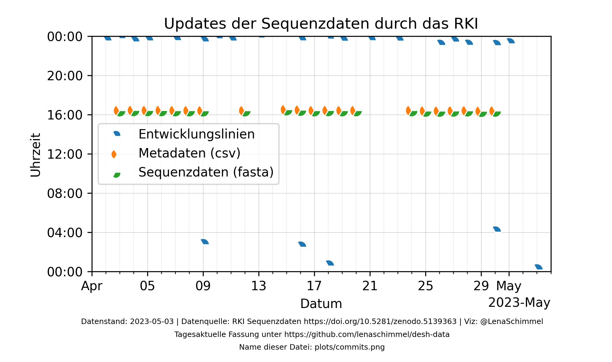

# Verteilung der SARS-CoV-2-Varianten in Deutschland

## Datenquelle und weitere Informationen
Die Auswertungen basieren auf dem Datensatz ["SARS-CoV-2-Sequenzdaten aus Deutschland"](https://github.com/robert-koch-institut/SARS-CoV-2-Sequenzdaten_aus_Deutschland) des Robert-Koch-Instituts. Zur Aktualität dieser Daten siehe auch den Abschnitt "Aktualität" weiter unten.

Dieses Repository ist ein Fork des gleichnamigen Repositories von @corneliusroemer. Für weitere Informationen und eine umfrangreichere README siehe [dort](https://github.com/corneliusroemer/desh-data).

## Variantenanteile in Deutschland
Die unten stehenden Grafiken basieren auf der "Repräsentativen Surveillance" in Deutschland, d.h. aus allen PCR-positiven Proben eines Tages werden zufällig bis zu 5% ausgewählt und Sequenziert. Durch die Sequenzierung kann die Variante genau bestimmt werden.

Die beiden folgenden Grafiken unterscheiden sich nur in der Skalierung der Y-Achse. Die lineare Skala ist einfacher zu lesen, für die Extrapolation des Verlaufs in die Zukunft ist eine Logit-Skala oft praktischer.

Linear                                       |  Logit
:-------------------------------------------:|:-------------------------:
 | 

In den folgenden Darstellungen wurden ähnliche Varianten (derzeit nur BA.1 und BA.1.1) zusammen gefasst:

Linear                                                 |  Logit
:-----------------------------------------------------:|:-------------------------:
 | 

## Aktualität
Die Grafiken werden alle zwei Stunden neu generiert, aber ihre Inhalte sind natürlich nur so aktuell wie die zu Grunde liegenden Daten des RKI. Diese werden etwa einmal täglich aktualisiert, im letzten Monat wie folgt.

Genau genommen sind in den Grafiken und Tabellen nur Sequenzen enthalten, die sowohl in den _Entwicklungslinien_ als auch in den _Metadaten_ vorliegen. Die ältere dieser beiden Dateien gibt somit den tatäschlichen Datenstand dieser Auswertungen vor.

## Weitere Auswertungen
 * Detaillierte [Auswertung auf Bundeslandebene](https://github.com/mg14/desh-data/blob/bundeslaender/genomicsurveillance.ipynb) von [Moritz Gerstung](https://github.com/mg14) - leider nicht stets aktuell

## License

The underlying files that I use as input are licensed by RKI under CC-BY 4.0, see more details here: <https://github.com/robert-koch-institut/SARS-CoV-2-Sequenzdaten_aus_Deutschland#lizenz>.

The software here is licensed under the "Unlicense". You can do with it whatever you want.
